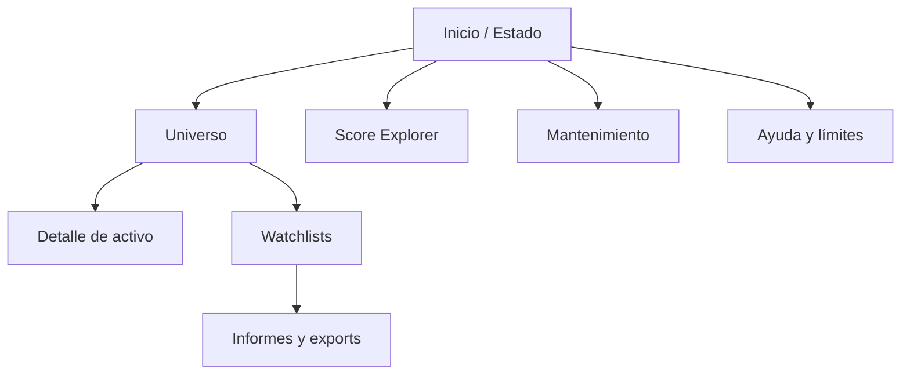

# Local UI information architecture

The sidebar keeps the five main destinations visible. Asset detail opens from the catalog without discarding filter state. Maintenance remains advanced and read-only by default.

## Global status bar

Every screen shows:

- universe pointer health;
- scoring state;
- refresh state;
- generated artifact provenance;
- “No es asesoramiento financiero”.

Status may not rely on color alone.
